### Лабораторные работы по дисциплине "Системы обработки больших данных"

В данном репозитории представлены лабораторные работы и курсовая работа (ознакомиться с ней вы сможете, прочитав файл README)

---
### Подключение к кластеру

1. Установите среду разработки [Microsoft Visual Studio Code](https://code.visualstudio.com/).
2. Запустите `VS Code`, на левой панели откройте вкладку `Extensions` и установите расширения `Python`, `Jupyter`, `Remote - SSH`.
3. На левой панели откройте вкладку `Remote Explorer`, наведите мышкой на строку `SSH` и щелкните знак `+`.
4. В открывшейся строке наберите следующую команду, заменив `user`, `ip` и `port` на параметры учетной записи. Учетные записи на кластере доступны в ЭИОС. Если система сообщает, что порт `12345` занят, вместо него используйте любой свободный.

```
ssh -D 12345 -J user@ip:port user@hadoop-node
```

После введения строки укажите файл `~/.ssh/config` в качестве хранилища записи.

После этого в файле `~/.ssh/config` появится запись вида:

```
Host hadoop-node
  HostName hadoop-node
  DynamicForward 12345
  ProxyJump user@ip:port
  User user
```

5. Щелкните по кнопке с изображением стрелки на появившемся хосте. Если VS Code запросит платформу удалённого узла, укажите `Linux`.
   
6. При запросе пароля от учетной введите его (возможно, дважды). Дождитесь соединения с кластером и настройки удалённого сервера.
   
7. Установите на удаленный сервер расширения `Python` и `Jupyter` тем же способом, что и ранее (убедитесь, что рядом с именем расширения указано `Install in SSH: hadoop-node`)
   
8. Нажмите на вкладку `Terminal` на панели инструментов `VS Code` и откройте новый терминал.
   
9. Проверьте доступность файловой системы `HDFS`, набрав команду:

```
hdfs dfs -ls /
```

*Подробнее про необходимые данные для подключения к кластеру узнайте у своего системного администратора.*


---

### Описание датасета

В качестве рассматриваемого датасета использовался датасет с сайта [Kaggle](https://www.kaggle.com/).

Для проведения анализа был выбран датасет, содержащий информацию о шахматных позициях, предназначенный для обучения шахматных движков. Источник данных и полное описание можно найти по ссылке на [датасет](https://www.kaggle.com/datasets/joannpeeler/labeled-chess-positions-109m-csv). 

Датасет состоит из 109 миллионов записей, каждая из которых представляет собой описание шахматной партии.

Датасет имеет следующие признаки:
##### Таблица 1 – Описание признаков датасета

| Признак      | Расшифровка признака                                                                 |
|--------------|--------------------------------------------------------------------------------------|
| **Hash**     | Уникальный идентификатор позиции на шахматной доске                                 |
| **Ply**      | Количество полуходов (ходов для белых и черных) в текущей игре                      |
| **GamePly**  | Номер полного хода в игре (для белых и черных)                                      |
| **FEN**      | Представление позиции на доске в формате Forsyth-Edwards Notation (FEN)            |
| **HasCastled** | Показывает, было ли сделано рокирование: 0 — не было, 1, 2, 3 — было               |
| **Eval**     | Оценка текущей позиции в терминах силы (положительное значение для белых, отрицательное для черных) |
| **Result**   | Результат игры: 0.0 — поражение, 0.5 — ничья, 1.0 — победа                         |

А теперь давайте посмотрим какие же значения у нас хранятся в датасете в столбцах. Для этого выведем первые 20 элементов каждого столбца из датасета.
<div id="header" align="center">
  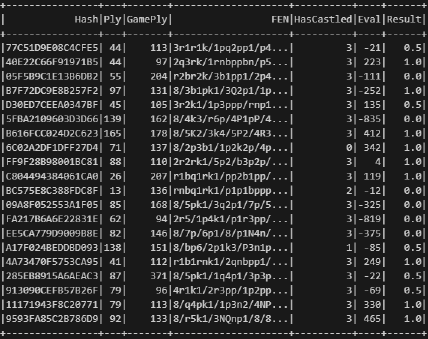
  <p> Рисунок 1 – Данные из датасета </p> 
</div>

А теперь, давайте разберемся какие данные нам пригодятся для дальнейшего регрессионного (LogisticRegression) анализа, а именно какие столбцы. Т.к. логистическая регрессия зачастую отвечает на вопросы "бинарного" характера (т.е. будет / не будет, да / нет 1 / 0 и т.д.), то нам можно будет избавиться от столбцов Hash И FEN, которые отвечают за позиции шахматных фигур на доске. Оставив остальные столбцы, а заодно посмотрим их тип данных. (см. рисунок 2)
<div id="header" align="center">
  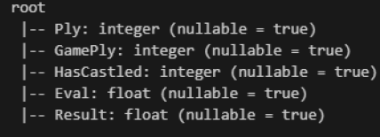
  <p> Рисунок 2 – Схема выбранных столбцов датафрейма </p> 
</div>

Оказывается, что в нашем датасете, оказалось: 109 154 250 элементов. (Что достаточно объемно, ведь датасет в распакованном виде весит около 10 Gb). 

### Анализ столбцов 

Далее просмотрим, что за данные хранятся в каждом из столбцов (но для наглядности просмотрим стобец количественный - GamePly и качесвтенный - HasCastled).
<div id="header" align="center">
  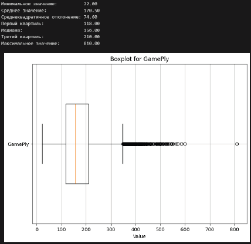
  <p> Рисунок 3 – BoxPlot (ящик с усами) для столбца GamePly "Кол-во полных шагов в матче" </p> 
</div>

<div id="header" align="center">
  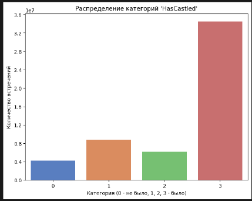
  <p> Рисунок 4 – Гистограмма для столбца HasCastled (были-ли рокировки)  </p> 
</div>
На гистограмме отчетливо видно, что кол-во рокировок 3 используется наибольшим спросом, что значит что в большинтсве матчей используется 3 рокировки.

<div id="header" align="center">
  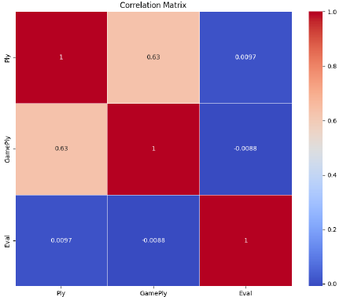
  <p> Рисунок 5 – Матрица корреляции </p> 
</div>

---

### Регрессионный анализ (LogisticRegression - логистическая регрессия)

Перед тем как приступить к обучению модели и предсказанию данных, сначала проведем "балансировку" данных столбца Result. (Именно этот столбец и будем предсказывать). Результаты анализа баланса столбца Result представлены на рисунке 6.

<div id="header" align="center">
  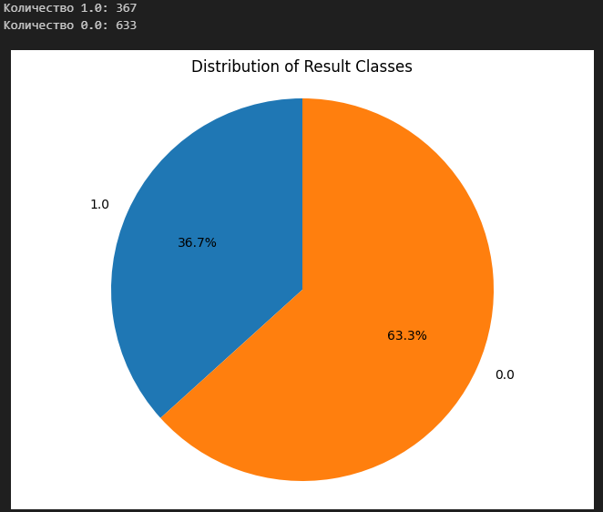
  <p> Рисунок 6 – Диаграмма баланса данных столбца Result </p> 
</div>

Для обучения и тестирования модели будет испоьзоваться принцип 80 на 20 (80 процентов данных для обучения, 20 процентов данных для тестирования). 

В результате может получить вот такую таблицу предсказаний нашего значения Result и исходного (того, на чем модель не обучалась). (см. рисунок 7)

<div id="header" align="center">
  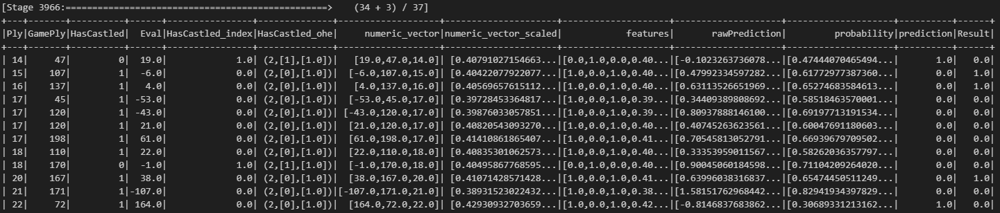
  <p> Рисунок 7 – Таблица предсказуемого значения с исходным </p> 
</div>

Используем метрики AUC и Accurecy для оценки нашей модели.
<div id="header" align="center">
  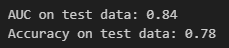
  <p> Рисунок 8 – Результат по метрикам AUC и Accuracy </p> 
</div>

Далее просмотрим, как наша модель зависела от итерации обучения. Точнее как наша функция ошибки изменялась с увеличением кол-ва итераций.
<div id="header" align="center">
  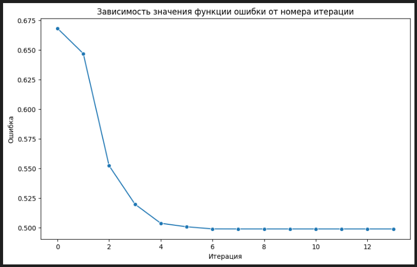
  <p> Рисунок 9 – График зависимости значений функции ошибки от итерации </p> 
</div>

Далее посмотрим на гистрограмму предсказуемых значений. Если большинство предсказанных вероятностей положительного класса находятся близко к 1, это может означать, что модель уверена в своих положительных предсказаниях, если предсказанные вероятности распределены близко к 0.5, это может означать, что модель сталкивается с трудностями в классификации или не имеет четких границ между классами.
<div id="header" align="center">
  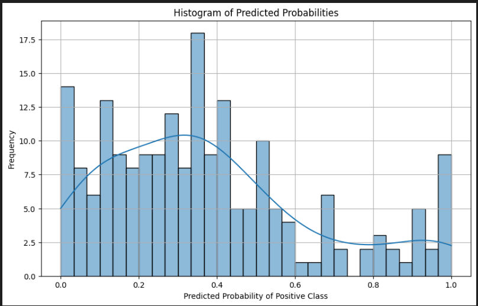
  <p> Рисунок 10 – Гистрограмма предсказуемых значений </p> 
</div>

а теперь, посмотрим на матрицу ошибок.
<div id="header" align="center">
  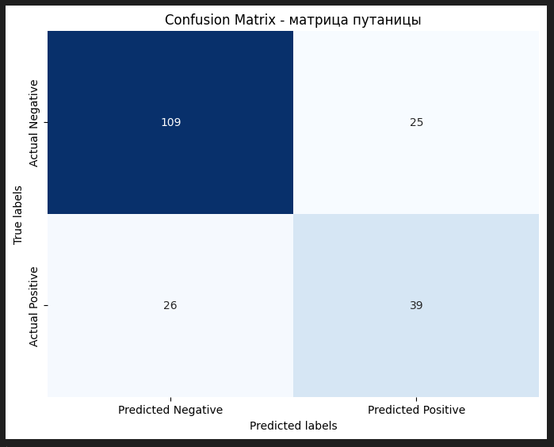
  <p> Рисунок 11  – Матрица ошибок </p> 
</div>

Проанализируем результатыт матрицы ошибок:
#### •	Актуальный негатив и предсказанный позитив (False Positives, FP): 25.
#### •	Актуальный позитив и предсказанный негатив (False Negatives, FN): 26.
#### •	Актуальный позитив и предсказанный позитив (True Positives, TP): 39.

Показатели указывают на то, что модель имеет разумную точность, но она может быть улучшена, так как точность положительных предсказаний и полнота ниже 70 процентов.

---

В рамках данной работы был проведен разведочный анализ большого датасета шахматных позиций с использованием фреймворка Apache Spark, что позволило эффективно обработать и проанализировать данные, относящиеся к
шахматным партиям. В процессе выполнения задачи были реализованы ключевые этапы обработки данных, включая их загрузку, предобработку для дальнейшего анализа, сам регрессионный анализ и анализ уже полученных результатов.

---


### Список использованных источников

1. **Apache Iceberg**. — 2025.  
   [https://iceberg.apache.org/](https://iceberg.apache.org/)  
   Дата обращения: 12.01.2025.

2. **Kaggle**. — 2025.  
   [https://www.kaggle.com/](https://www.kaggle.com/)  
   Дата обращения: 13.01.2025.

3. **Labeled Chess Positions dataset**. — 2025.  
   [https://www.kaggle.com/datasets/joannpeeler/labeled-chess-positions-109m-csv](https://www.kaggle.com/datasets/joannpeeler/labeled-chess-positions-109m-csv)  
   Дата обращения: 08.01.2025.

4. **Лабораторные работы по дисциплине “Системы обработки больших данных”**. — 2025.  
   [https://github.com/kpdvstu/SOBD/blob/main/2024](https://github.com/kpdvstu/SOBD/blob/main/2024)  
   Дата обращения: 07.01.2025.

5. **Hadoop Distributed File System**. — 2025.  
   [https://habr.com/ru/articles/42858/](https://habr.com/ru/articles/42858/)  
   Дата обращения: 11.01.2025.

6. **Apache Spark**. — 2025.  
   [https://spark.apache.org/](https://spark.apache.org/)  
   Дата обращения: 09.01.2025.

7. **Визуализация данных с matplotlib**. — 2025.  
   [https://nsu-programming.github.io/textbook/python/plotting.html](https://nsu-programming.github.io/textbook/python/plotting.html)  
   Дата обращения: 11.01.2025.

